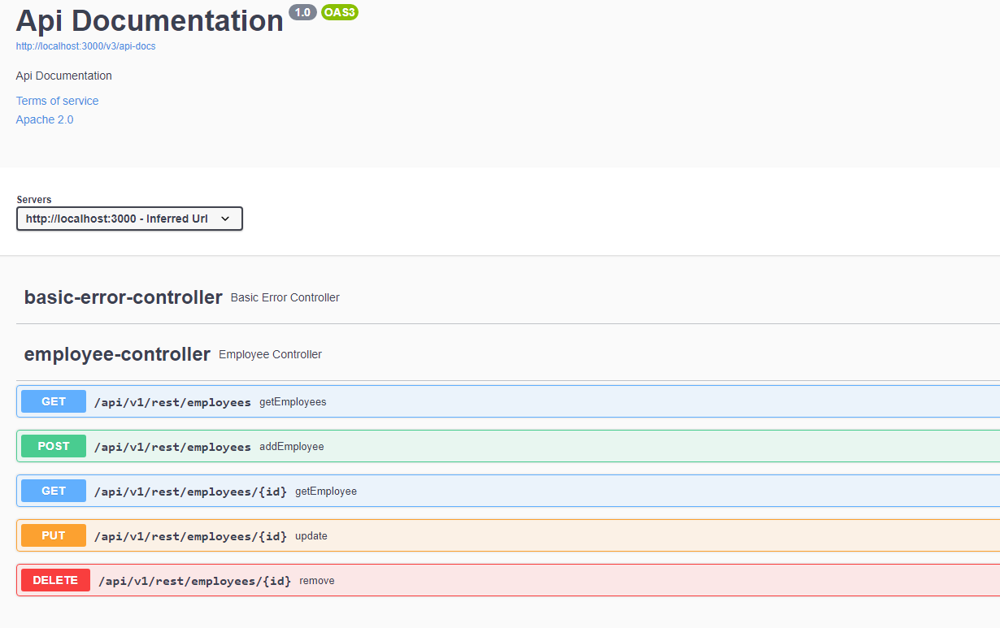

# Aphira: API de gestion des employés pour les petites entreprises (Mini Projet <b>CARREFOUR-ITECH 2022 </b>)

* L’idée étant de gérer des employés, l’API devra donc offrir un CRUD (Create, Read, Update, Delete) pour les données sur les employés.

* Les données seront dans une base de données H2 pour cette implémentation expérimentale

# STARTERS ET DEPENDANCES UTILISES

* Spring web
```xml
		<dependency>
			<groupId>org.springframework.boot</groupId>
			<artifactId>spring-boot-starter-web</artifactId>
		</dependency>

```

* Lombok
```xml
		<dependency>
			<groupId>org.projectlombok</groupId>
			<artifactId>lombok</artifactId>
			<optional>true</optional>
		</dependency>
```

* H2 Database
```xml
		<dependency>
			<groupId>com.h2database</groupId>
			<artifactId>h2</artifactId>
			<scope>runtime</scope>
		</dependency>
```

* Spring data JPA
```xml
		<dependency>
			<groupId>org.springframework.boot</groupId>
			<artifactId>spring-boot-starter-data-jpa</artifactId>
		</dependency>
``` 

* Springfox 
 ```xml
 <dependency>
<groupId>io.springfox</groupId>
<artifactId>springfox-boot-starter</artifactId>
<version>3.0.0</version>
</dependency>
 ```
# BASE DE DONNEES
Script sql : src/main/java/com/resources/data.sql

 # DOCUMENTATION DE L'API : SWAGGER

* localhost:3000/swagger-ui/
<p align="center">
 </div>
</p>
  
Pour plus d'informations contactez Tamaroas Dev sur facebook ou envoyez moi un Mail (<b>martialkom123@gmail.com</b>)


